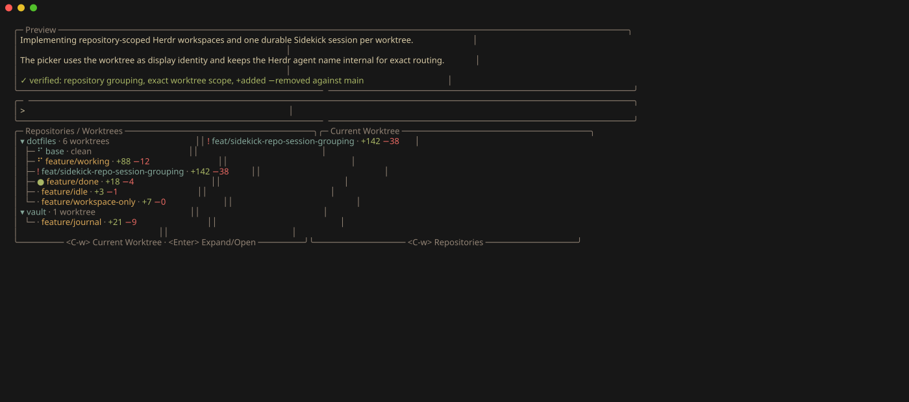

# Sidekick repository/worktree picker evidence

This capture shows the implemented picker contract: repositories expand into worktrees, each worktree row represents
its one durable Sidekick session, the worktree name uses the agent backend color, and tracked line changes against
local `main` appear as `+added −removed`. The bottom-right pane shows only the current worktree.



The ANSI row content and layout labels use the deterministic fixtures asserted by:

```sh
scripts/verify-nvim sidekick-herdr
```

The frame is presentation evidence rather than a substitute for the verifier. Render the ANSI capture with:

```sh
freeze --execute "awk '1' docs/evidence/sidekick-repository-worktree-picker/picker.ansi" \
  --output docs/evidence/sidekick-repository-worktree-picker/picker.svg \
  --width 1400 --height 620 --font.size 13 --window
```

## Captures

- `picker.ansi`: terminal-native SGR rendering.
- `picker.svg`: reviewable rendering generated by Charmbracelet Freeze.

## SHA-256

```text
897bf9ce1bb5d1b4160249004750dd9655a6d65b1ed811d5b71f56c4b8c5612a  picker.ansi
7b7ec0e53843008553c33f8703f6b93021de707f9c5933581f11cd597c98607c  picker.svg
```
