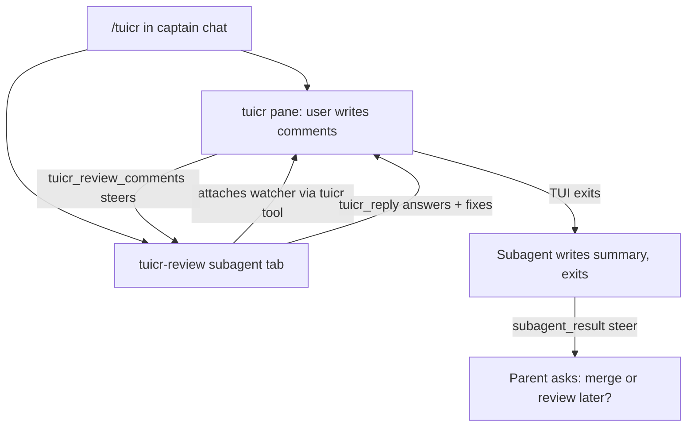

# tuicr extension

Interactive code review through [tuicr](https://github.com/aviralmansingka/tuicr)
for pi sessions running inside a multiplexer (Herdr, tmux, Zellij, cmux).

## The review flow (preferred)

`/tuicr` opens a review with the **tuicr-review subagent**. One command, two
surfaces: a tuicr TUI pane for the human, a subagent tab for the agent.

```text
/tuicr                     working tree of the session repo
/tuicr open                same, explicit
/tuicr pr 272              GitHub PR 272 of the session repo
/tuicr open pr 272         same, explicit
/tuicr -r main..HEAD       a commit range
/tuicr open -w ~/some/repo working tree of another checkout
```



How it works:

1. `tuicr_review` (the tool behind `/tuicr`) launches the multiplexer wrapper
   detached — the pane opens, the call returns immediately — or attaches to the
   active session when one exists.
2. It spawns the `tuicr-review` agent (via `interactive-subagents`) with the
   repo and session slug. The subagent attaches **its own** comment watcher
   with the internal `tuicr` tool (`attachOnly`) and parks in `waiting`.
3. Every user comment steers into the subagent. It answers inside the TUI with
   `tuicr_reply` and applies fixes for actionable comments.
4. When the human closes the TUI, the watcher steers the final notice, the
   subagent writes a summary of every comment and fix, and its session exits —
   the summary steers back to the parent, which asks the user whether to merge
   or review later.

The parent chat never answers review comments while the subagent runs; a
same-repo chat watcher is stopped on launch so comments are not double-steered.

## Tools

| Tool | Audience | Description |
| --- | --- | --- |
| `tuicr_review` | captain | Open a review (working tree, revset, or PR) with the tuicr-review subagent. The preferred route. |
| `tuicr` | internal | Attach this session's comment watcher to an active session; `attachOnly` never opens a pane. Used by the tuicr-review subagent. |
| `tuicr_reply` | any watcher host | Post a reply inside the TUI, anchored to a file/line or comment id. |

`/tuicr watch …` runs the internal chat-watcher mode directly (comments steer
into the captain chat instead of a subagent) and `/tuicr stop` stops it. This
mode exists for debugging and for sessions without `interactive-subagents`.

## Environment

| Variable | Default | Purpose |
| --- | --- | --- |
| `TUICR_BG_POLL_MS` | `15000` | Comment poll interval |
| `TUICR_BG_COALESCE_MS` | `30000` | Batch coalescing window |
| `TUICR_BG_LAUNCH_WAIT_MS` | `25000` | Slug resolution wait after launch |
| `TUICR_SKILL_DIR` | `~/.agents/skills/tuicr` | Where the multiplexer wrapper scripts live |
