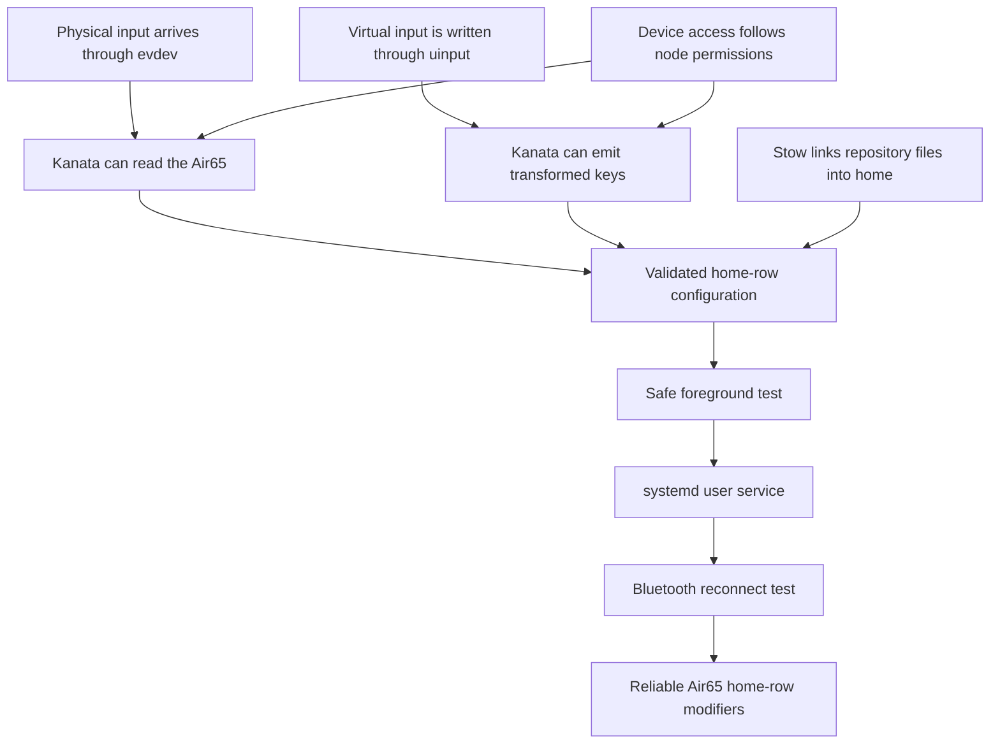

# Kanata Setup Session

## Goal

Install a least-privilege Kanata service for the Air65 Bluetooth keyboard and verify mirrored
home-row modifiers without losing keyboard recovery access.

Full reference: [handout.md](./handout.md)

## Dependency map

## Confirmed foundations

- [x] Kanata reads physical events from evdev and writes virtual events through uinput.
- [x] The Bluetooth pairing agent connects the device but does not grant remapper permissions.
- [x] `/dev/uinput`, not the Air65 event node, is the current unprivileged-access blocker.
- [x] A user service receives device access from the user's supplementary groups and udev modes.
- [x] Group changes require a fresh login before the existing user manager inherits them.
- [x] Stow links package-tree paths beneath the selected home-directory target.
- [x] `--no-wait` lets a failed background process exit so systemd can restart it.
- [x] With `Linger=no`, the user service begins after login rather than during early boot.
- [x] Hyprland applies XKB processing after Kanata's virtual output.
- [x] The prior-idle value is a look-back threshold, not an added output delay.

## Chosen design

- [x] Use the installed pacman-owned Kanata 1.12.0 executable at `/usr/bin/kanata`.
- [x] Store the shared configuration at `kanata/.config/kanata/config.kbd`.
- [x] Store the Linux unit with the existing `systemd` Stow package.
- [x] Match the exact device name `Air65 V3-3 Keyboard` for reconnect safety.
- [x] Start with mirrored home-row modifiers.
- [x] Leave the existing Hyprland `ctrl:nocaps` setting unchanged.
- [x] Guided execution plan approved.

## Hands-on nodes

- [x] Verify the installed Kanata package ownership and version.
- [x] Create persistent least-privilege uinput access.
- [ ] Refresh the login session and verify group inheritance.
- [x] Create and Stow the tested keymap.
- [x] Validate the keymap without grabbing input devices.
- [x] Run a recoverable foreground test.
- [x] Create, enable, and inspect the user service.
- [ ] Verify Bluetooth sleep and reconnection behavior physically.
- [x] Demonstrate tap, opposite-hand hold, and fast-roll behavior in the simulator.

## Current interaction

Interactive teaching ended at the user's request. Kanata is enabled and running against only the
Air65 keyboard. The number row is split between `defhands`, enabling right-hand `;` as Super with
workspace keys `1–5`. Home-row actions now use the release-aware opposite-hand variant to preserve
normal cross-hand rolls such as `l` then `a`. A temporary named-user ACL bridges the current user
manager's pre-change group set.

## Next step

After the next full logout and login, confirm `id -nG` includes `uinput` and that the user service
remains active. Physically power-cycle the Air65 to complete the reconnect check.
