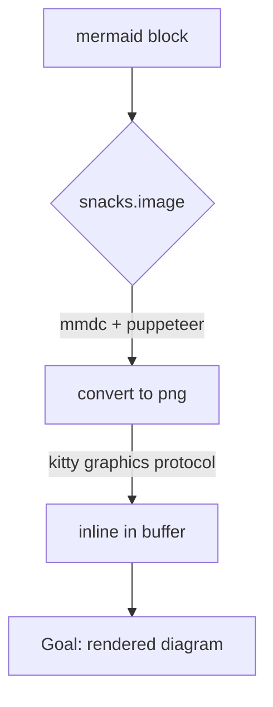
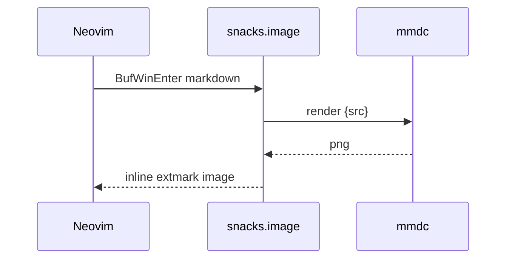

# Mermaid prototype test

Snacks image should render this block inline:

```mermaid
flowchart TD
  A[mermaid block] --> B{snacks.image}
  B -->|mmdc + puppeteer| C[convert to png]
  C -->|kitty graphics protocol| D[inline in buffer]
  D --> Z[Goal: rendered diagram]
```

Sequence diagram:

```mermaid
sequenceDiagram
  participant N as Neovim
  participant S as snacks.image
  participant M as mmdc
  N->>S: BufWinEnter markdown
  S->>M: render {src}
  M-->>S: png
  S-->>N: inline extmark image
```
